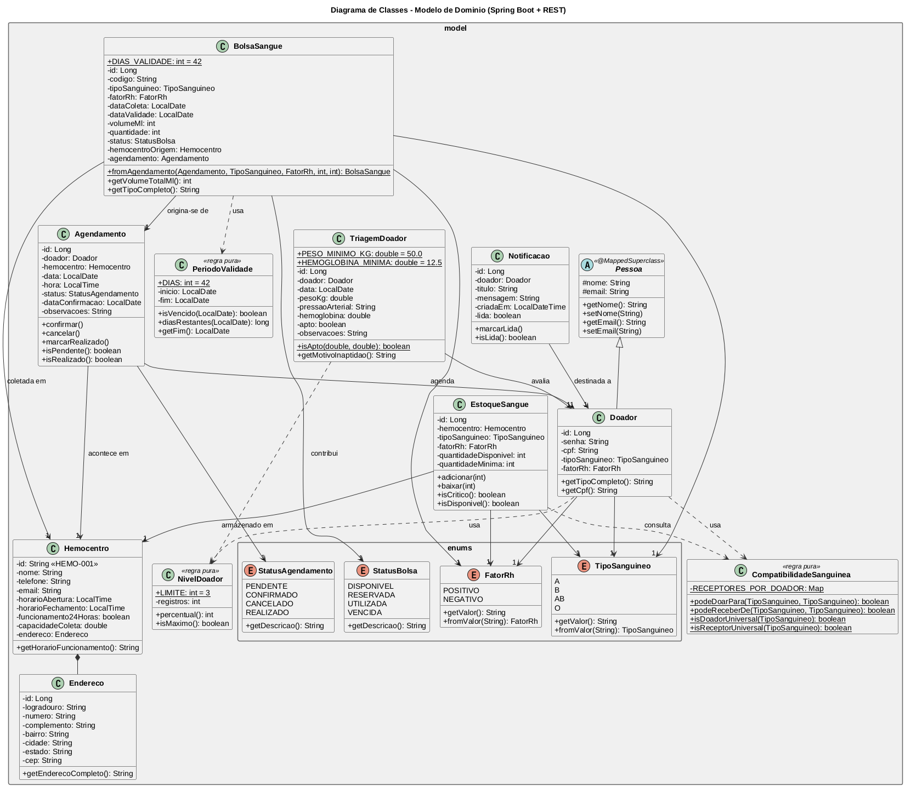

# API de Doação de Sangue (Spring Boot + REST + PostgreSQL)

Backend REST que dá suporte ao controle de doação de sangue. Fornece cadastro e
login de doadores, agendamento de doações, registro de coletas, controle de
estoque por hemocentro, triagem clínica e notificações — além de uma **interface
WEB** (SPA em HTML/CSS/JS servida pela própria aplicação) que consome a API.

## Tecnologias

- **Java 21** + **Spring Boot 4.1.1** (Web MVC, Data JPA, Validation)
- **PostgreSQL** (via `compose.yaml`) + **Flyway** (migrações `V1`–`V9`)
- **Gradle** (wrapper) — `./gradlew`
- Front-end: HTML + CSS + JavaScript puro (sem build), em `src/main/resources/static`

## Como Executar

Pré-requisito: **Java 21**. O Gradle deste projeto não roda no Java 27 (erro
`Unsupported class file major version 71`). Com o mise:

```bash
export JAVA_HOME=/home/rod/.local/share/mise/installs/java/21.0.2
export PATH="$JAVA_HOME/bin:$PATH"
```

1. Suba o banco:

```bash
sudo docker compose up -d
```

2. Rode a aplicação:

```bash
./gradlew bootRun
```

3. Abra a interface WEB: **http://localhost:8080/**

4. Testes:

```bash
./gradlew test
```

> Os testes de unidade rodam sem banco (ex.: `./gradlew test --tests 'edu.unifaj.ppi.model.*' --tests 'edu.unifaj.ppi.service.*'`).
> O teste de contexto (`PpiApplicationTests`) exige o PostgreSQL no ar.

## Interface WEB

A SPA fica em `src/main/resources/static/` e é servida na raiz (`/`). Telas:

| Tela | Chamadas de API |
|------|-----------------|
| Login / Cadastro | `POST /api/doadores/login`, `POST /api/doadores` |
| Início | `GET /api/doadores/{cpf}`, `GET /api/bolsas-sangue?cpf`, `GET /api/estoque/criticos` |
| Agendar | `GET /api/hemocentros`, `POST /api/agendamentos?cpf` |
| Agendamentos | `GET /api/agendamentos?cpf`, `GET /api/agendamentos/para-registro?cpf`, `POST /api/agendamentos/{id}/cancelar?cpf`, `POST /api/bolsas-sangue/agendamentos/{id}/coletas?cpf` |
| Histórico | `GET /api/bolsas-sangue?cpf` |
| Estoque | `GET /api/estoque`, `GET /api/estoque/criticos`, `PUT /api/estoque/{id}` |
| Triagem | `GET`/`POST /api/doadores/{cpf}/triagens` |
| Notificações | `GET /api/doadores/{cpf}/notificacoes`, `GET .../nao-lidas`, `POST .../{id}/ler` |
| Perfil | `GET`/`PUT /api/doadores/{cpf}` |

## Endpoints da API

### Doadores — `/api/doadores`

| Método | Rota | Descrição |
|--------|------|-----------|
| POST | `/api/doadores` | Cadastra doador |
| POST | `/api/doadores/login` | Autentica (email + senha) |
| GET | `/api/doadores/{cpf}` | Perfil + nível do doador |
| PUT | `/api/doadores/{cpf}` | Atualiza nome, e-mail e/ou senha |

### Agendamentos — `/api/agendamentos`

| Método | Rota | Descrição |
|--------|------|-----------|
| GET | `/api/agendamentos?cpf=` | Lista agendamentos do doador |
| GET | `/api/agendamentos/para-registro?cpf=` | Agendamentos elegíveis para coleta |
| GET | `/api/agendamentos/quantidades?cpf=` | Quantidade de bolsas por agendamento |
| POST | `/api/agendamentos?cpf=` | Cria agendamento |
| POST | `/api/agendamentos/{id}/cancelar?cpf=` | Cancela agendamento |

### Coletas / Bolsas — `/api/bolsas-sangue`

| Método | Rota | Descrição |
|--------|------|-----------|
| GET | `/api/bolsas-sangue?cpf=` | Histórico de lotes do doador |
| POST | `/api/bolsas-sangue/agendamentos/{id}/coletas?cpf=` | Registra coleta (gera lote e entrada no estoque) |

### Estoque — `/api/estoque`

| Método | Rota | Descrição |
|--------|------|-----------|
| GET | `/api/estoque` | Estoque por tipo sanguíneo/hemocentro |
| GET | `/api/estoque/criticos` | Combinações no nível mínimo |
| PUT | `/api/estoque/{id}` | Ajusta a quantidade mínima |

### Triagem — `/api/doadores/{cpf}/triagens`

| Método | Rota | Descrição |
|--------|------|-----------|
| POST | `/api/doadores/{cpf}/triagens` | Registra triagem (calcula aptidão) |
| GET | `/api/doadores/{cpf}/triagens` | Histórico de triagens |
| GET | `/api/doadores/{cpf}/triagens/ultima` | Última triagem |

### Notificações — `/api/doadores/{cpf}/notificacoes`

| Método | Rota | Descrição |
|--------|------|-----------|
| GET | `/api/doadores/{cpf}/notificacoes` | Lista notificações |
| GET | `/api/doadores/{cpf}/notificacoes/nao-lidas` | Total de não lidas |
| POST | `/api/doadores/{cpf}/notificacoes/{id}/ler` | Marca como lida |

### Hemocentros — `/api/hemocentros`

| Método | Rota | Descrição |
|--------|------|-----------|
| GET | `/api/hemocentros` | Lista hemocentros |

## Diagrama de Classes



Fonte PlantUML: [`diagramas/classes-dominio.puml`](diagramas/classes-dominio.puml).

O modelo de domínio tem mais de 10 classes de negócio, com herança
(`Pessoa` → `Doador`) e classes de regra pura (`CompatibilidadeSanguinea`,
`PeriodoValidade`, `NivelDoador`):

```text
model/
├── enums/            TipoSanguineo, FatorRh, StatusAgendamento, StatusBolsa
├── Pessoa            (abstrata / @MappedSuperclass)
├── Doador            (estende Pessoa)
├── Hemocentro, Endereco
├── Agendamento, BolsaSangue
├── EstoqueSangue, TriagemDoador, Notificacao
└── NivelDoador, CompatibilidadeSanguinea, PeriodoValidade (regras puras)
```

## Autores

- Rodolfo Rodrigues Pinheiro - RA: 12530689
- Rodrigo Pereira Junior - RA: 12529249
- Camilli dos Santos - RA: 12529495
- Otávio Siqueira Gonçalves - RA: 12529937
- Gabriel Rodrigues de Oliveira - RA: 12529520
